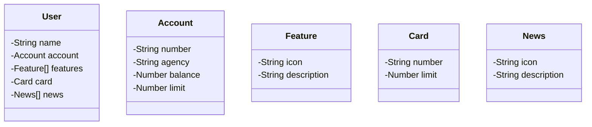

# DIO - Trilha Java Básico
Site: <a href="https://www.dio.me/" target="_blank">DIO</a>

# Desafio API RESTful
Projeto de API RESTful utilizando java e Spring Boot

## Diagrama de Classes - Domínio da API

#### Autor : [Matheus Pacheco](https://github.com/matheuspacheco99)

